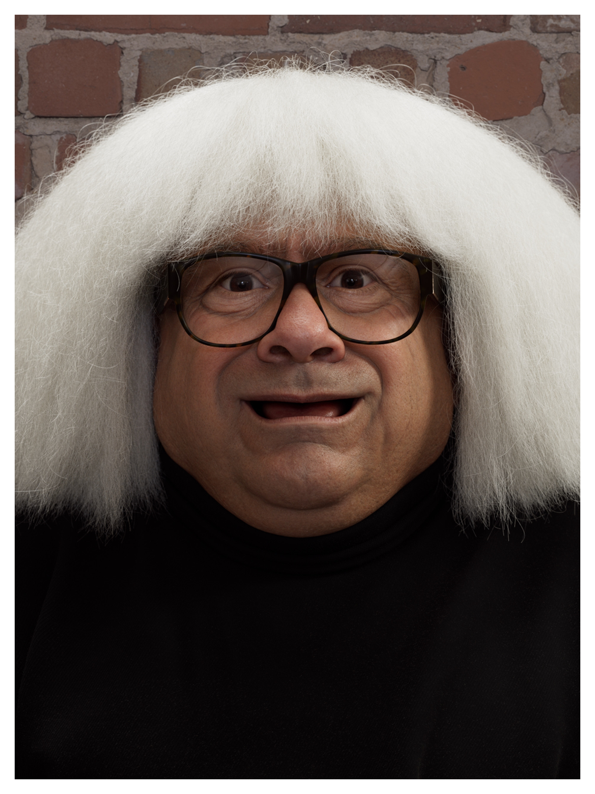

# remarkable-file-mover

A few scripts to process an image for a remarkable tablet sleep screen, and push it to the device via ssh. Currently this only updates the sleep screen.

## Installation

To install the environment needed to run these scripts, follow the directions below. In a terminal, run the commands shown. You will need to have python installed and git.

Linux:
- Will be added soon

Windows:
```bash
git clone https://github.com/rasbot/remarkable-file-mover.git
cd remarkable-file-mover
python -m venv venv
.\venv\Scripts\activate
pip install -r requirements.txt
pip install -e .
```

### Install PuTTY

This specific implementation uses PuTTY to SSH into the remarkable device. Go to: [https://www.putty.org/](https://www.putty.org/) and download the install file and run it.

### Create a config txt file

In the root directory of the repo, add a new text file and rename it to `remarkable_config.txt`. This file will be hidden (greyed out) since it was added to `.gitignore`, and since this will contain your login info for the remarkable, keep in mind of this and do not share your PASSWORD.

In the text file, you will need to define some parameters:
```
REMARKABLE_IP=*********
REMARKABLE_PASSWORD=*******
SOURCE_PATH=<path_to_your_image_to_upload>\suspended.png
DESTINATION_DIR=/usr/share/remarkable
PUTTY_PATH=C:\Program Files\PuTTY
DESTINATION_FILE=suspended.png
```
The IP and PASSWORD for your remarkable can be found by following the directions here [https://remarkable.guide/guide/access/ssh.html](https://remarkable.guide/guide/access/ssh.html)

The `SOURCE_PATH` will be the full path to the final image you want to upload using the bat script. For instance, "C:\Users\Azathoth\Pictures\suspended.png"

__Note:__ For Windows paths, you need to use "\". For Linux paths, you need to use "/". The `SOURCE_PATH` and `PUTTY_PATH` here are Windows paths, whereas the `DESTINATION_DIR` path is on the remarkable device, which is Linux.

The `DESTINATION_PATH` and `DESTINATION_FILE` do not need to be updated, as this will only change the sleep screen.

`PUTTY_PATH` is the path to the directory that the PuTTY executable file lives in. The path provided was the default installation path when I installed it.

## Usage

### Image processing

The image processing scripts will take an image and:
- crop it to the aspect ratio of the remarkable tablet
- resize the image to the resolution of the remarkable tablet
- can add a white border around the image if you want
- moves / renames the file to a target destination

#### Process and move image

To do the image processing and move the image file, run the `src/process_and_move.py` script.

In the terminal, run
```bash
$ python .\src\process_and_move.py --help
```
to see the list of command line args you can use.

The args are:
- `--source`, `-s`: The full path to the image. In Windows, you can copy this from Windows explorer by right clicking on an image and selecting "Copy as path", or by using "Ctrl + Shift + c".
- `--width`, `-w`: Target width of the image (width of the remarkable screen in pixels, defaults to 1620)
- `--height`, `-h`: Target height of the image (height of the remarkable screen in pixels, defaults to 2160)
- `--position`, `-p`: Position to anchor to when cropping the image. Options are:
  - center: Crops height / width from the center of the image.

#### Image Comparison

<p align="center">
  
  <br>
  <b>Original Image</b>
</p>

<table>
  <tr>
    <td align="center">
      <br>
      <b>Center Cropped Image</b>
    </td>
    <td align="center">
      <br>
      <b>Left Cropped Image</b>
    </td>
    <td align="center">
      <br>
      <b>Right Cropped Image</b>
    </td>
  </tr>
</table>

<p align="center">
  
  <br>
  <b>Cropped Image with Border</b>
</p>
